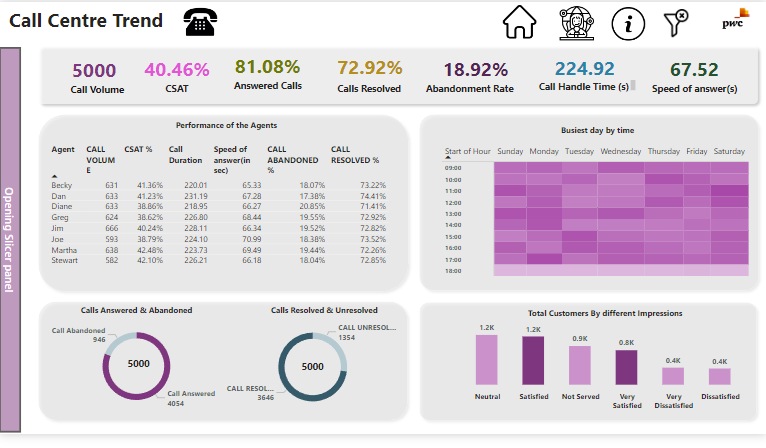
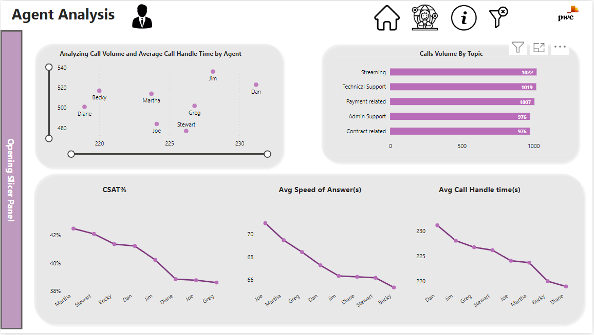
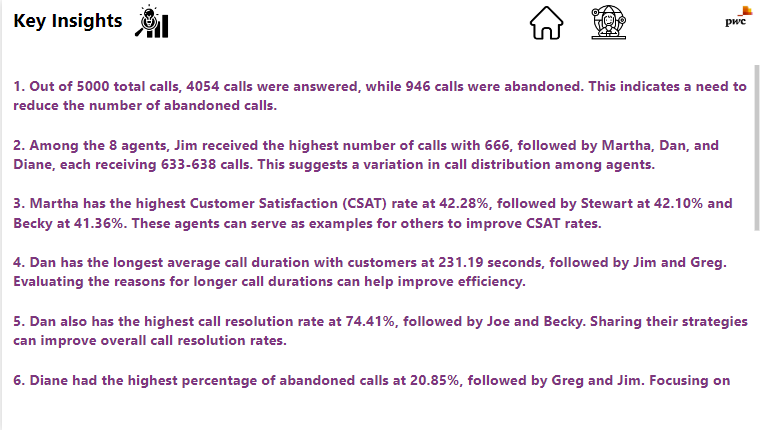
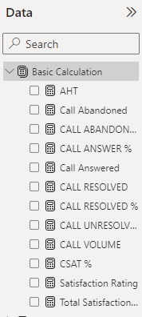
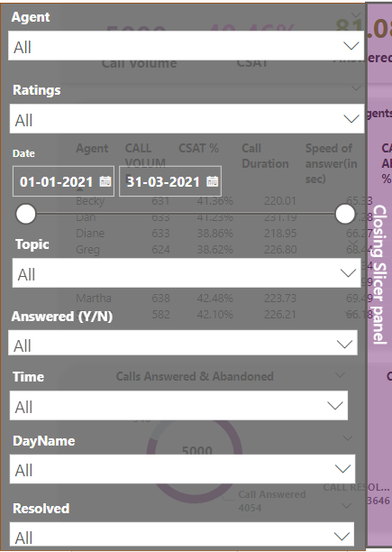

# Pwc-Call-Centre-Analysis

---

## Introduction
 This is the first task of Pwc Virtual Internship on forage platform. This Power BI Report is designed for the telecom industry to understand the trends and patterns, through visuals and relevant KPI'S
 

 ## Problem Statement
 - Create a dashboard in Power BI for visualizing relevant KPIs and metrics in the dataset provided.
 - Utilize the resources provided, including podcasts and articles, to enhance your understanding of data visualization and upskilling.
 - Respond to the client's request by providing a well-designed Power BI dashboard reflecting the requested KPIs

## Skills Demonstrated
The following Power BI features were incorporated :
- Bookmarking
- Data Modeling
- DAX(Data Analysis Expression)
- Page Navigation
- Filters
- Buttons

## Modelling
 Since there is one table. So, there is no need of Data Modelling.

 ## Visualization
 The Power BI Report Consist of 3 pages :
 
 
**Overview**

---

**Agent Analysis**
 

---

 **Insights**
 

---
**DAX Measure**

---

**Slicer Panel**

---

You can interact with my Power BI report [Here]([https://app.powerbi.com/view?r=eyJrIjoiODMzZjQwZWItNTAyMC00ZDA1LTgxMjUtMTQ2YmQ5ZTlmYzRkIiwidCI6IjM4N2IyZTQ0LTM2ZTEtNDliMy04OWMxLTc1NDM4ZDc3NmQ1MiJ9](https://www.novypro.com/project/call-centre-trend-5)https://www.novypro.com/project/call-centre-trend-5)

